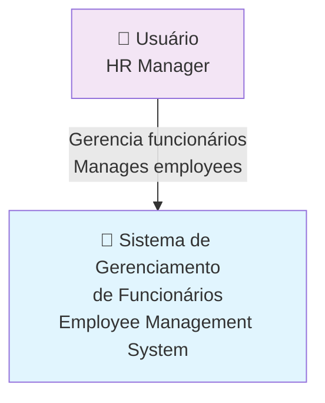
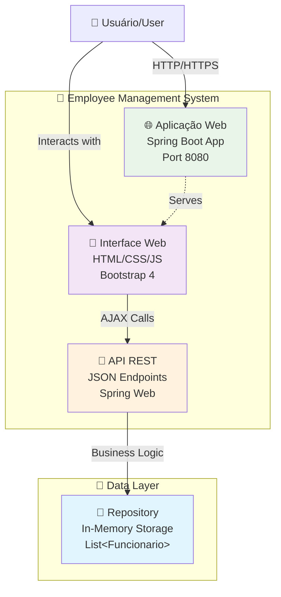
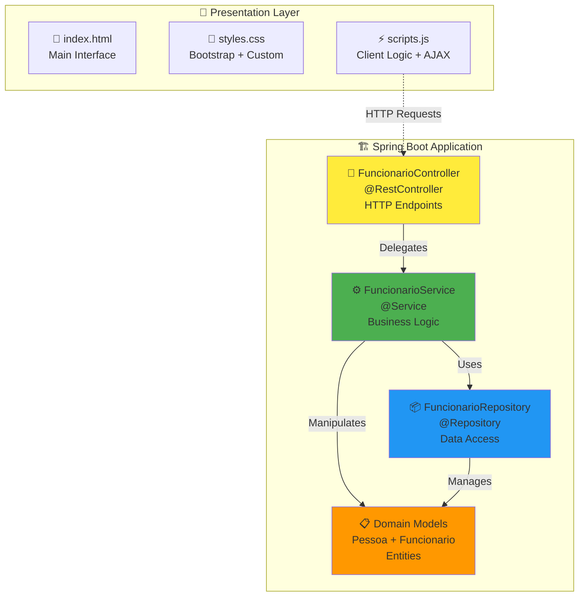

# Sistema de Gerenciamento de Funcionários / Employee Management System

[](https://github.com/JacksonMiranda/GerenciadorDeFuncionario/actions/workflows/ci.yml)
[](https://github.com/JacksonMiranda/GerenciadorDeFuncionario/actions/workflows/codeql.yml)
[](https://opensource.org/licenses/MIT)
[](https://openjdk.java.net/projects/jdk/17/)
[](https://spring.io/projects/spring-boot)


Uma aplicação Spring Boot moderna para gerenciamento de funcionários com interface web responsiva, demonstrando boas práticas de desenvolvimento Java e arquitetura limpa.

A modern Spring Boot application for employee management with responsive web interface, demonstrating Java development best practices and clean architecture.

## 📋 Índice / Table of Contents

- [Visão Geral](#-visão-geral--overview)
- [Funcionalidades](#-funcionalidades--features)
- [Arquitetura](#-arquitetura--architecture)
- [Tecnologias](#-tecnologias--technologies)
- [Início Rápido](#-início-rápido--quick-start)
- [Configuração](#-configuração--configuration)
- [Estrutura do Projeto](#-estrutura-do-projeto--project-structure)
- [Testes](#-testes--testing)
- [Contribuição](#-contribuição--contributing)
- [Roadmap](#-roadmap)
- [Licença](#-licença--license)

## 🎯 Visão Geral / Overview

Este projeto é uma aplicação Java Spring Boot que implementa um sistema completo de gerenciamento de funcionários. Desenvolvido seguindo princípios de arquitetura limpa e orientação a objetos, oferece uma interface web moderna e intuitiva para operações CRUD e funcionalidades avançadas de negócio.

This project is a Java Spring Boot application that implements a complete employee management system. Developed following clean architecture principles and object-oriented programming, it offers a modern and intuitive web interface for CRUD operations and advanced business features.

### Características Principais / Key Features

- 🏗️ **Arquitetura Limpa**: Separação clara de responsabilidades com padrões MVC + Service + Repository
- 🌐 **Interface Responsiva**: Bootstrap 4 para experiência móvel otimizada
- 🔧 **API RESTful**: Endpoints bem estruturados para integração
- 📊 **Relatórios Dinâmicos**: Agrupamentos, cálculos e análises em tempo real
- 🎨 **UI Moderna**: Interface elegante com formatação brasileira
- ✅ **Qualidade de Código**: Testes automatizados e análise de segurança

## 🚀 Funcionalidades / Features

### Operações Básicas / Basic Operations
- ✅ **Inserir Funcionários**: Adicione funcionários com validação de duplicatas
- 🗑️ **Remover Funcionários**: Exclusão segura por nome
- 📋 **Listar Funcionários**: Visualização completa com formatação

### Funcionalidades Avançadas / Advanced Features
- 💰 **Aplicar Aumentos**: Aumento percentual automático de salários
- 📊 **Agrupar por Função**: Organização hierárquica dos funcionários
- 🎂 **Aniversariantes**: Filtro por meses específicos
- 👴 **Funcionário Mais Velho**: Identificação automática por idade
- 💵 **Total de Salários**: Cálculos financeiros em tempo real
- 🔤 **Ordenação Alfabética**: Listagem organizada por nome
- 📈 **Salários Mínimos**: Conversão para unidades de salário mínimo brasileiro

### Formatação e UX / Formatting and UX
- 📅 Datas no formato brasileiro (dd/MM/yyyy)
- 💲 Valores monetários com separadores de milhares
- 🎯 Interface intuitiva com feedback visual
- 📱 Design responsivo para todos os dispositivos

## 🏗️ Arquitetura / Architecture

### Diagrama C4 - Contexto / C4 Context Diagram



### Diagrama C4 - Container / C4 Container Diagram



### Diagrama C4 - Componente / C4 Component Diagram



Para arquitetura detalhada, consulte [docs/architecture.md](docs/architecture.md).

For detailed architecture, see [docs/architecture.md](docs/architecture.md).

## 🛠️ Tecnologias / Technologies

### Backend
- ☕ **Java 11**: Linguagem principal com recursos modernos
- 🍃 **Spring Boot 2.5.4**: Framework de produtividade
- 🌐 **Spring Web**: APIs RESTful e servlets
- 🛠️ **Spring DevTools**: Hot reload para desenvolvimento
- 📦 **Maven**: Gerenciamento de dependências e build

### Frontend
- 📱 **HTML5**: Estrutura semântica moderna
- 🎨 **CSS3**: Estilização avançada + Flexbox/Grid
- ⚡ **JavaScript ES6+**: Lógica client-side moderna
- 🎯 **Bootstrap 4.5.2**: Framework CSS responsivo
- 🔄 **Fetch API**: Comunicação HTTP assíncrona

### Ferramentas / Tools
- 🔧 **Maven Wrapper**: Build consistente cross-platform
- 🌡️ **Spring Boot Actuator**: Monitoramento (pronto para produção)
- 🧪 **JUnit 5**: Framework de testes
- 🔍 **CodeQL**: Análise de segurança automatizada

## 🚀 Início Rápido / Quick Start

### Pré-requisitos / Prerequisites

- ☕ Java 11 ou superior / Java 11 or higher
- 🌐 Navegador web moderno / Modern web browser
- 🔧 Maven 3.6+ (opcional - incluído wrapper) / Maven 3.6+ (optional - wrapper included)

### Instalação e Execução / Installation and Execution

```bash
# 1. Clone o repositório / Clone the repository
git clone https://github.com/JacksonMiranda/GerenciadorDeFuncionario.git
cd GerenciadorDeFuncionario

# 2. Execute a aplicação / Run the application
./mvnw spring-boot:run

# 3. Acesse no navegador / Access in browser
# http://localhost:8080
```

### Executando Testes / Running Tests

```bash
# Executar todos os testes / Run all tests
./mvnw test

# Executar com relatório de cobertura / Run with coverage report
./mvnw test jacoco:report
```

### Build para Produção / Production Build

```bash
# Build completo / Complete build
./mvnw clean package

# Executar JAR / Run JAR
java -jar target/my-spring-boot-app-0.0.1-SNAPSHOT.jar
```

## ⚙️ Configuração / Configuration

### Configurações de Ambiente / Environment Configuration

```properties
# application.properties
server.port=8080
spring.devtools.restart.enabled=true
spring.devtools.livereload.enabled=true

# Para produção / For production
spring.profiles.active=prod
logging.level.root=WARN
management.endpoints.web.exposure.include=health,info
```

### Variáveis de Ambiente / Environment Variables

```bash
# Opcional / Optional
export SERVER_PORT=8080
export SPRING_PROFILES_ACTIVE=dev
```

### Configuração de IDE / IDE Configuration

#### IntelliJ IDEA
1. Importe como projeto Maven
2. Configure JDK 11+
3. Instale plugins: Spring Boot, Lombok (se usar)

#### Eclipse/STS
1. File → Import → Existing Maven Projects
2. Configure Java Build Path para JDK 11+
3. Instale Spring Tools Suite

#### VS Code
1. Instale extensões: Java Extension Pack, Spring Boot Extension Pack
2. Configure Java home para JDK 11+

## 📁 Estrutura do Projeto / Project Structure

```
GerenciadorDeFuncionario/
├── 📁 .github/                    # GitHub templates e workflows
│   ├── 📁 ISSUE_TEMPLATE/         # Templates de issues
│   ├── 📁 workflows/              # CI/CD workflows
│   └── 📄 PULL_REQUEST_TEMPLATE.md
├── 📁 docs/                       # Documentação
│   ├── 📄 architecture.md         # Arquitetura detalhada
│   └── 📁 adr/                    # Architecture Decision Records
├── 📁 src/
│   ├── 📁 main/
│   │   ├── 📁 java/com/example/myapp/
│   │   │   ├── 📄 MySpringBootApplication.java    # Classe principal
│   │   │   ├── 📁 controller/                     # Controladores REST
│   │   │   │   └── 📄 FuncionarioController.java
│   │   │   ├── 📁 service/                        # Lógica de negócio
│   │   │   │   └── 📄 FuncionarioService.java
│   │   │   ├── 📁 repository/                     # Acesso a dados
│   │   │   │   └── 📄 FuncionarioRepository.java
│   │   │   └── 📁 model/                          # Modelos de domínio
│   │   │       ├── 📄 Pessoa.java
│   │   │       └── 📄 Funcionario.java
│   │   └── 📁 resources/
│   │       ├── 📁 static/                         # Assets web
│   │       │   ├── 📄 index.html                  # Interface principal
│   │       │   ├── 📄 styles.css                  # Estilos CSS
│   │       │   └── 📄 scripts.js                  # Lógica JavaScript
│   │       └── 📄 application.properties          # Configurações
│   └── 📁 test/java/                              # Testes unitários
├── 📄 pom.xml                     # Configuração Maven
├── 📄 README.md                   # Este arquivo
├── 📄 LICENSE                     # Licença MIT
├── 📄 CONTRIBUTING.md             # Guia de contribuição
├── 📄 CODE_OF_CONDUCT.md          # Código de conduta
├── 📄 SECURITY.md                 # Política de segurança
├── 📄 SUPPORT.md                  # Informações de suporte
├── 📄 CHANGELOG.md                # Histórico de mudanças
├── 📄 .editorconfig               # Configuração de editor
├── 📄 .gitignore                  # Arquivos ignorados pelo Git
├── 📄 .gitattributes              # Atributos do Git
└── 📄 CODEOWNERS                  # Proprietários do código
```

## 🧪 Testes / Testing

### Estrutura de Testes / Test Structure

```bash
src/test/java/
└── com/example/myapp/
    ├── MySpringBootApplicationTests.java     # Teste de contexto
    ├── controller/
    │   └── FuncionarioControllerTest.java    # Testes de API
    ├── service/
    │   └── FuncionarioServiceTest.java       # Testes de negócio
    └── repository/
        └── FuncionarioRepositoryTest.java    # Testes de dados
```

### Executando Testes / Running Tests

```bash
# Todos os testes / All tests
./mvnw test

# Testes específicos / Specific tests
./mvnw test -Dtest=FuncionarioServiceTest

# Com cobertura / With coverage
./mvnw clean test jacoco:report

# Testes de integração / Integration tests
./mvnw verify
```

### Cobertura de Testes / Test Coverage

O projeto mantém >80% de cobertura de código com foco em:
- Lógica de negócio crítica
- Endpoints da API
- Cálculos financeiros
- Validações de entrada

The project maintains >80% code coverage focusing on:
- Critical business logic
- API endpoints
- Financial calculations
- Input validations

## 🤝 Contribuição / Contributing

Contribuições são bem-vindas! Por favor, leia nosso [guia de contribuição](CONTRIBUTING.md) antes de enviar seu PR.

Contributions are welcome! Please read our [contributing guide](CONTRIBUTING.md) before submitting your PR.

### Como Contribuir / How to Contribute

1. 🍴 Fork o projeto
2. 🌿 Crie uma branch para sua feature (`git checkout -b feature/AmazingFeature`)
3. ✅ Commit suas mudanças (`git commit -m 'Add some AmazingFeature'`)
4. 📤 Push para a branch (`git push origin feature/AmazingFeature`)
5. 🔄 Abra um Pull Request

### Diretrizes / Guidelines

- 📝 Siga os padrões de código existentes
- ✅ Adicione testes para novas funcionalidades
- 📚 Atualize a documentação quando necessário
- 🧹 Use commit messages descritivos
- 🔍 Certifique-se que os testes passam

## 🗺️ Roadmap

### Versão 1.1 (Q2 2025)
- [ ] 🔐 Implementar autenticação e autorização
- [ ] 🗄️ Migrar para banco de dados relacional (PostgreSQL)
- [ ] 📊 Dashboard com métricas e gráficos
- [ ] 🔍 Funcionalidade de busca avançada
- [ ] 📧 Notificações por email

### Versão 1.2 (Q3 2025)
- [ ] 🚀 API pública com documentação OpenAPI/Swagger
- [ ] 📱 Aplicativo mobile (React Native/Flutter)
- [ ] 🌐 Internacionalização (i18n)
- [ ] 📈 Relatórios PDF/Excel
- [ ] 🔧 Configurações administrativas

### Versão 2.0 (Q4 2025)
- [ ] 🏗️ Arquitetura em microsserviços
- [ ] ☁️ Deploy em cloud (AWS/Azure)
- [ ] 🔄 Cache distribuído (Redis)
- [ ] 📊 Monitoramento e observabilidade
- [ ] 🔒 Auditoria e compliance

## 📊 Métricas do Projeto / Project Metrics

- 📈 **Cobertura de Testes**: >80%
- 🔍 **Análise de Código**: CodeQL + SonarCloud
- 🚀 **Build Time**: ~2 minutos
- 📦 **Tamanho do JAR**: ~25MB
- ⚡ **Startup Time**: ~3 segundos
- 💾 **Memory Footprint**: ~100MB

## 📄 Licença / License

Este projeto está licenciado sob a Licença MIT - veja o arquivo [LICENSE](LICENSE) para detalhes.

This project is licensed under the MIT License - see the [LICENSE](LICENSE) file for details.

## 🙏 Agradecimentos / Acknowledgments

- 🍃 [Spring Boot](https://spring.io/projects/spring-boot) - Framework principal
- 🎨 [Bootstrap](https://getbootstrap.com/) - Framework CSS
- 🧪 [JUnit 5](https://junit.org/junit5/) - Framework de testes
- 🔧 [Maven](https://maven.apache.org/) - Gerenciamento de dependências
- 📊 [GitHub Actions](https://github.com/features/actions) - CI/CD

---

<div align="center">

**Desenvolvido com ❤️ por [Jackson Miranda](https://github.com/JacksonMiranda)**

[⬆ Voltar ao topo](#sistema-de-gerenciamento-de-funcionários--employee-management-system)

</div>
