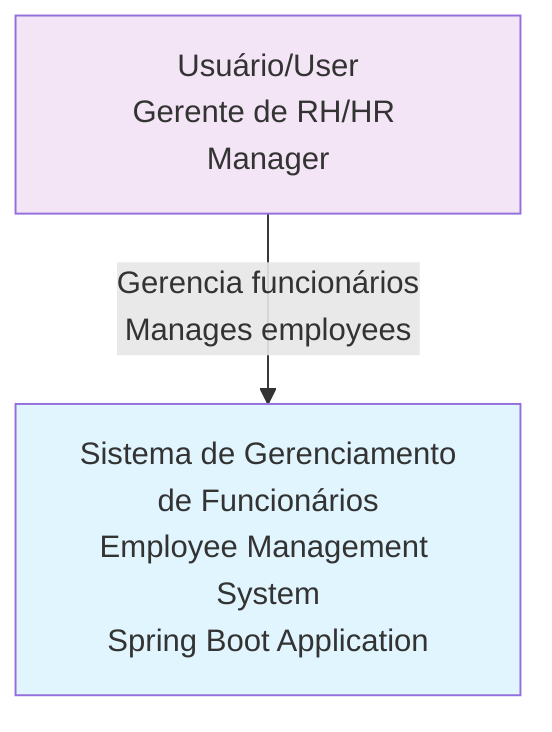
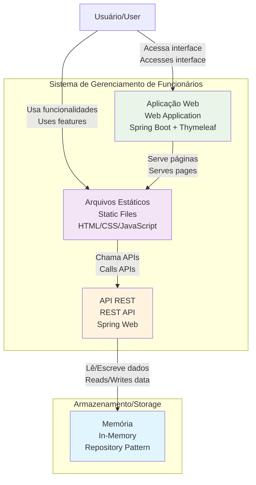
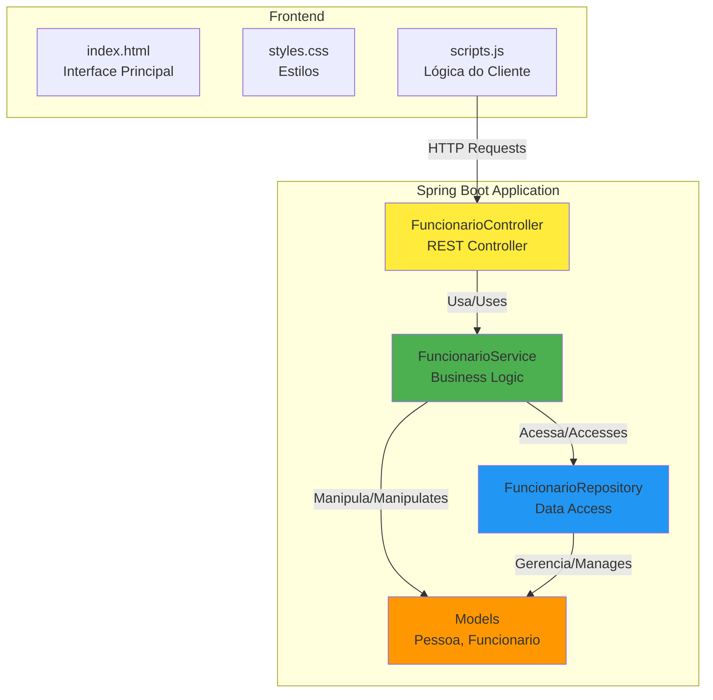
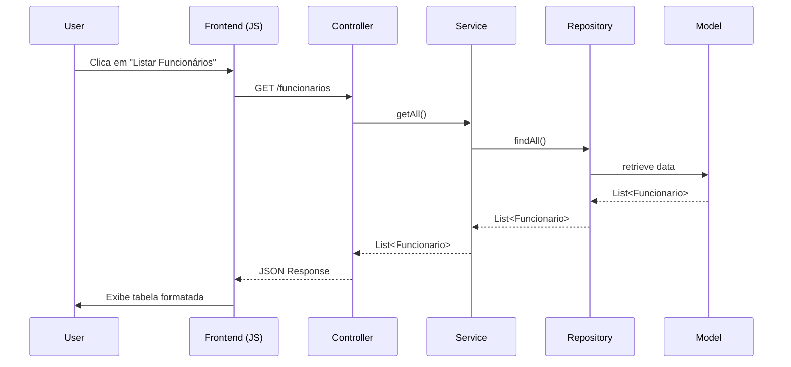

# Arquitetura do Sistema / System Architecture

## Visão Geral / Overview

O Gerenciador de Funcionários é uma aplicação Spring Boot que implementa um sistema de gerenciamento de funcionários com interface web. A arquitetura segue os princípios de separação de responsabilidades e clean architecture.

The Employee Manager is a Spring Boot application that implements an employee management system with a web interface. The architecture follows the principles of separation of concerns and clean architecture.

## Diagrama C4 - Contexto / C4 Context Diagram



## Diagrama C4 - Container / C4 Container Diagram



## Diagrama C4 - Componente / C4 Component Diagram



## Camadas da Aplicação / Application Layers

### 1. Presentation Layer (Camada de Apresentação)

**Componentes:**
- `index.html`: Interface principal do usuário
- `styles.css`: Estilos e layout responsivo
- `scripts.js`: Lógica do lado cliente e chamadas AJAX

**Responsabilidades:**
- Apresentar dados ao usuário
- Capturar interações do usuário
- Fazer requisições HTTP para a API
- Formatar dados para exibição

### 2. Controller Layer (Camada de Controle)

**Componente:** `FuncionarioController`

**Responsabilidades:**
- Receber requisições HTTP
- Validar parâmetros de entrada
- Chamar serviços apropriados
- Retornar respostas HTTP adequadas

**Endpoints:**
```java
GET    /funcionarios              // Listar todos
POST   /funcionarios/inserir-todos // Inserir funcionários
DELETE /funcionarios/{nome}       // Remover por nome
POST   /funcionarios/aumento      // Aplicar aumento
GET    /funcionarios/agrupados    // Agrupar por função
// ... outros endpoints
```

### 3. Service Layer (Camada de Serviço)

**Componente:** `FuncionarioService`

**Responsabilidades:**
- Implementar regras de negócio
- Coordenar operações complexas
- Realizar cálculos e transformações
- Validar dados de negócio

**Principais Métodos:**
- `getAll()`: Recuperar todos os funcionários
- `addFuncionario()`: Adicionar funcionário
- `aplicarAumento()`: Aplicar aumento salarial
- `agruparPorFuncao()`: Agrupar funcionários
- `getAniversariantes()`: Encontrar aniversariantes

### 4. Repository Layer (Camada de Repositório)

**Componente:** `FuncionarioRepository`

**Responsabilidades:**
- Abstração de acesso a dados
- Operações CRUD básicas
- Consultas específicas
- Gerenciamento da persistência

### 5. Model Layer (Camada de Modelo)

**Componentes:**
- `Pessoa`: Classe abstrata base
- `Funcionario`: Entidade principal

**Características:**
- Encapsulamento de dados
- Validações básicas
- Relacionamentos entre entidades

## Padrões de Design Utilizados / Design Patterns Used

### 1. MVC (Model-View-Controller)
- **Model**: Classes `Pessoa` e `Funcionario`
- **View**: Interface HTML/CSS/JavaScript
- **Controller**: `FuncionarioController`

### 2. Repository Pattern
- `FuncionarioRepository` abstrai o acesso a dados
- Permite trocar implementação de persistência

### 3. Service Layer Pattern
- `FuncionarioService` concentra a lógica de negócio
- Separa regras de negócio da camada de controle

### 4. Dependency Injection
- Spring Framework gerencia dependências
- `@Autowired` para injeção automática

## Tecnologias e Frameworks / Technologies and Frameworks

### Backend
- **Java 11**: Linguagem principal
- **Spring Boot 2.5.4**: Framework principal
- **Spring Web**: Para APIs REST
- **Spring DevTools**: Desenvolvimento
- **Maven**: Gerenciamento de dependências

### Frontend
- **HTML5**: Estrutura das páginas
- **CSS3**: Estilos e layout
- **JavaScript ES6**: Lógica do cliente
- **Bootstrap 4.5.2**: Framework CSS
- **Fetch API**: Comunicação HTTP

### Ferramentas de Desenvolvimento
- **Maven Wrapper**: Build automatizado
- **Spring Boot DevTools**: Hot reload
- **Browser DevTools**: Debug frontend

## Fluxo de Dados / Data Flow



## Configuração e Deployment / Configuration and Deployment

### Configuração Local / Local Configuration
```properties
# application.properties
server.port=8080
spring.devtools.restart.enabled=true
```

### Build e Execução / Build and Execution
```bash
# Build
./mvnw clean compile

# Testes
./mvnw test

# Execução
./mvnw spring-boot:run
```

## Considerações de Segurança / Security Considerations

### Implementado / Implemented
- Validação de entrada básica
- Sanitização de dados
- Estrutura preparada para autenticação

### Recomendações para Produção / Production Recommendations
- Implementar autenticação e autorização
- Adicionar validação CSRF
- Configurar HTTPS
- Implementar rate limiting
- Adicionar logs de auditoria

## Escalabilidade / Scalability

### Limitações Atuais / Current Limitations
- Armazenamento em memória
- Aplicação monolítica
- Sem cache distribuído

### Possíveis Melhorias / Possible Improvements
- Adicionar banco de dados persistente
- Implementar cache (Redis)
- Separar em microsserviços
- Adicionar load balancing

## Manutenibilidade / Maintainability

### Boas Práticas Implementadas / Implemented Best Practices
- Separação clara de responsabilidades
- Código bem documentado
- Padrões consistentes
- Estrutura modular

### Ferramentas de Qualidade / Quality Tools
- Testes unitários (configurados)
- Análise estática de código (CodeQL)
- Documentação automática (JavaDoc)
- CI/CD pipeline